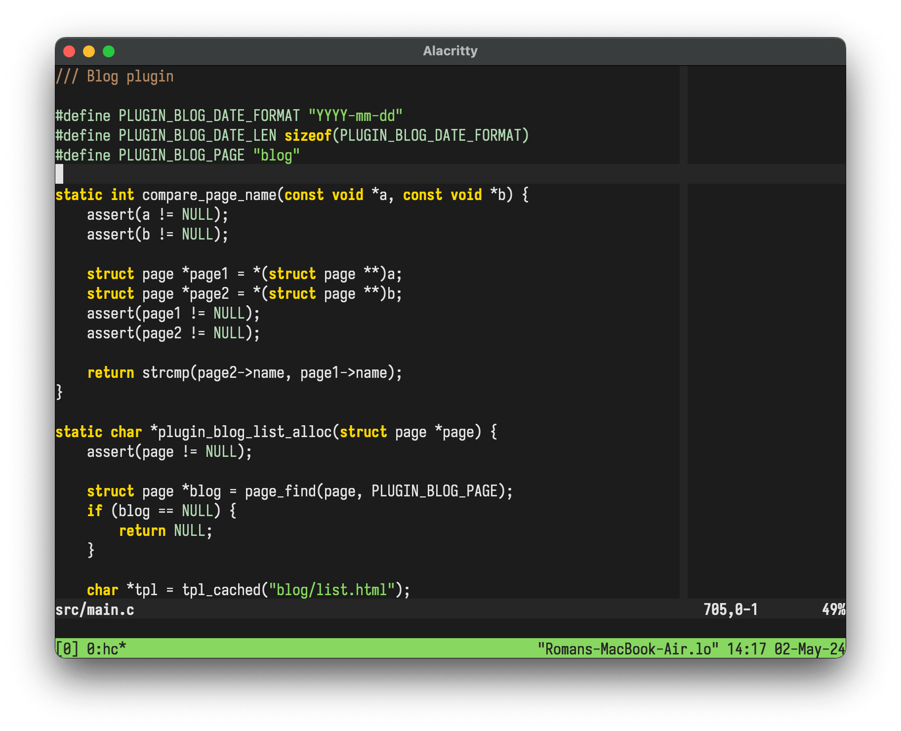

Ported to Vim and slightly modified Gruber Dark theme for BBEdit by John Gruber
(https://daringfireball.net/projects/bbcolors/schemes/). Colors have been
adjusted to match the Xterm 256 color palette.

1.  Install theme using plugin manager or copy manually to \~/.vim/colors
    (\~/.config/nvim/colors for Neovim)
2.  Apply theme in Vim by :colorscheme gruber
